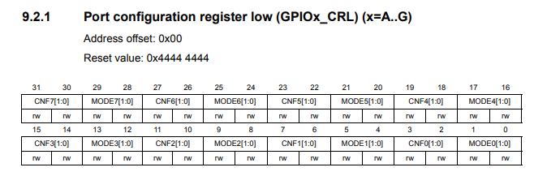
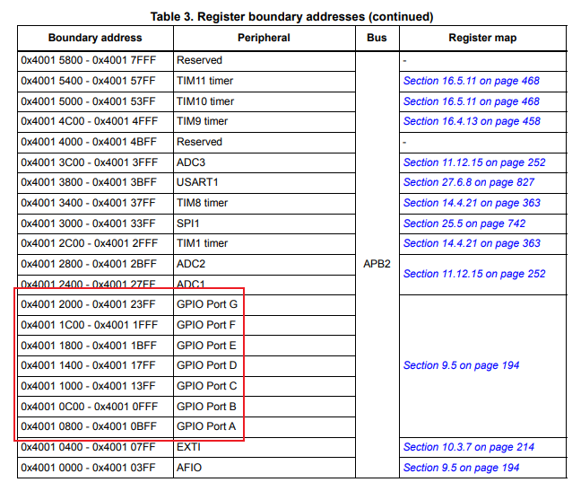
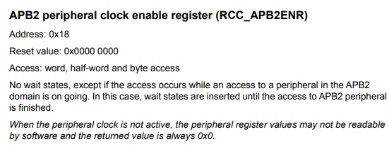
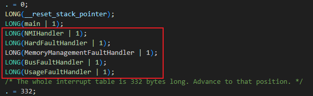

1. 当你要访问外部设备时，需要初始化与之相连的总线（AHB）始终。包括RCC_AHBENR，RCC_APB2ENR，RCC_APB1ENR
2. GPIO也算外部设备，通过APB2总线进行连接。GPIO Port一共有A~G 7个接口。每个接口又单独分出了16(0,15)的针脚。
3. STM32的每一个外设，用到的内存地址全部都被映射到了32位的内存地址当中。
    当我们去看GPIO的设置寄存器的时候，官方文档会告诉我们
   
   其次，再观察文档中关于GPIO的内存映射关系：
   
可以这样解读：GPIOA的所有寄存器起始地址在0x4001 0800，而它的GPIOA_CRL寄存器相对这个起始地址的偏移是0x00，即0x4001 0800 + 0x00。
观察这个GPIOx_CRL，其实它还有一个寄存器叫GPIOx_CRH(估计是Low和Hight的关系？)。这些寄存器里面每4个bit组成一对(CNFx, MODEx)，两个寄存器算上，一共有64位，每4位一对，总共有16对，刚好对应GPIOA的16组针脚。

4. 观察“点灯”源码发现：
   * 驱动GPIO接口之前，必须先让APB2总线时钟启动。代表这个总线处于激活状态，对应的寄存器是：
     
     虽然APB2总线是通过AHB总线连接的，但好像不需要启动AHB总线？其次，APB2总线的速率最高是可以开到芯片最高速率72MHz的

5. 中断向量表中指定的指令只能是Thumb类型的。至于普通执行的时候，其实我们不用关注当前是Thumb指令还是Arm。在编译的时候，只要指定了mcpu的架构，编译器会自动为我们选择合适的指令类型。至于指令架构的切换，理论上没有损耗，我们也不用关注架构的切换。

6. 要使用c++编写，除了使用g++进行编译链接以外，还需要将异常处理功能关闭！

7. 关于中断向量表，可以直接在ld里面增加

	假如当前使用的是c++，则需要对应的函数声明增加extern "C"，以避免c++自带的符号重整功能导致链接失败。如:
```cpp
extern "C" int HardFaultHandler();
int HardFaultHandler() {...}
```

8. 目前发现在c++中使用单例会造成Hard Fault! 单例对象的创建涉及到线程同步以及内存屏障两个功能，怀疑STM32不支持其中的某些功能！

##关于异常处理
1. fno-exceptions这个开关只是针对当前正在处理的cpp文件的！假如链接的库里面本来就有异常处理的代码，那么最后链接出来的二进制文件也还是一样有一堆的异常处理代码！
2. 链接时使用的libstdc++.a文件是一个完整的c++标准库实现！这意味着里面所有的标准库代码都是有异常处理逻辑的！可以使用arm提供的libstdc++_nano.a来代替。但是这个库不仅没有异常处理，还有一些类型相关的功能都没有。
3. 链接libstdc++_nano.a需要在链接器里面增加-specs=nosys.specs
4. 没有异常处理相关的内容以后，二进制文件明显小了非常非常多！

##关于使用了static然后异常的问题；
* 发现\_\_cxa\_guard\_acquire这个符号的实现有问题，它会跳转到usage fault里面 ！？？
* GetInstance的返回本来应该是一个静态对象的引用，但实际上却是返回一个null，导致之后的modifyValue的调用会出发hard fault，因为往null地址里面写入内容
* 其次hard fault之后，应用居然还可以返回！！！但是继续执行的结果肯定是异常的！
  
* 继续检查局部静态变量的初始化过程。一个局部静态变量通常包含变量本身，以及一个4字节大小的控制块(Control Block)。这些都是编译器帮我规定的。
* 继续分析__cxa_guard_quire以及__cxa_guard_release，它们在局部静态变量的初始化过程中大概执行以下内容：
```cpp
Object obj; // 局部静态变量本身
uint8_t ControlBlock[4]; // 4字节的控制块
void obj_init() // 当开始执行 ·static Object obj;· 时候，它实际执行的流程：
{
	if (ControlBlock[0] != 0)
 		return; // obj已经初始化过了
    bool guard = __cxa_guard_aquire(ControlBlock[0], ControlBlock[1]);
    if (guard == false)
    	return; // 已经有别的线程做过初始化了
	
    // obj没有被初始化，对obj调用Object的构造函数
    __cxa_guard_release(ControlBlock[0]);
    return;
}

bool __cxa_guard_aquire(const uint8_t& controlBlock0, uint8_t& controlBlock1)
{
	if (controlBlock0 != 0)
 		return false; // 已经有别的线程进行过guard_aquire了
   	if (controlBlock1 == 0) // 第一次调用guard_aquire
    {
    	controlBlock1 = 1; // 我已经拿到锁了，之后假如还有别的线程进来，那就是一个未定义的行为了
     	return true;
	}
 	abort();// crash !!!! 未定义的行为
}

void __cxa_guard_release(uint8_t& controlBlock0)
{
	controlBlock0 = 1;
 	return;
}
```
* 目前可以确定的是，通过__cxa_guard_aquire/release，就可以完成对控制块的设置，以确保之后不会再对局部静态变量进行初始化。但是这两个函数是否能够防止多线程冲突，这个是存疑的
> 不过考虑到目前的平台是stm32f103，也不可能存在什么多线程问题。暂且不进行深究。只要控制块在这些操作下能保证不进行多次初始化即可

* 回到崩溃的问题。事实上，从汇编上看，ControlBloc[0]和[1]只有第0位有效。也就是所有的if判断都只检查第0位。然而，纵观整个程序的汇编，**都没有对控制块进行初始化的代码**！！！控制块的状态完全就是上电是怎样它就是怎样。
* 所以，我还能观察到，有时候上电，它能正常运行，但大部分时候都会崩溃的原因！！

* 那么，又该如何对控制块进行初始化呢？ChatGPT的回复是：编译器会帮我做。但我的编译器没有帮我呀！！！