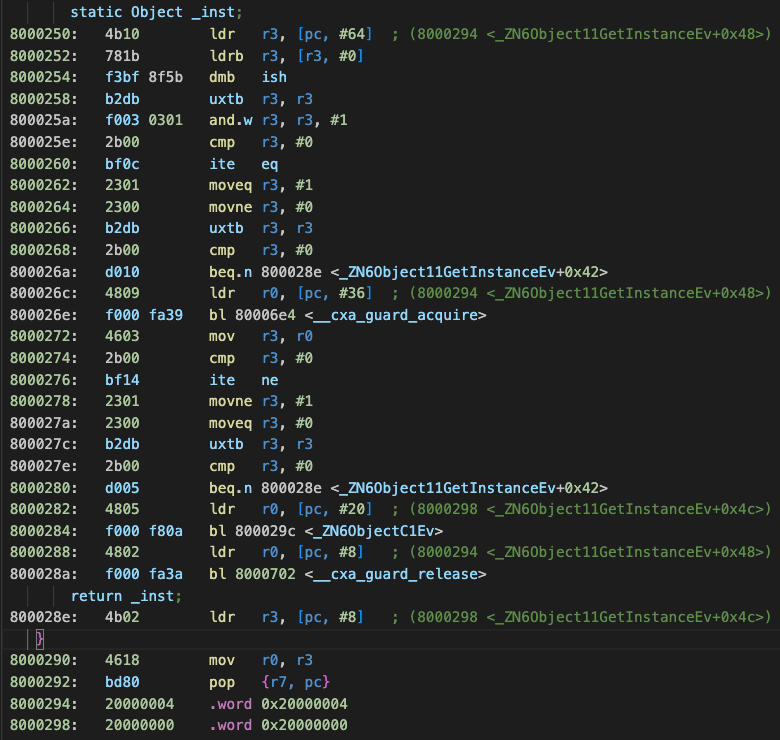
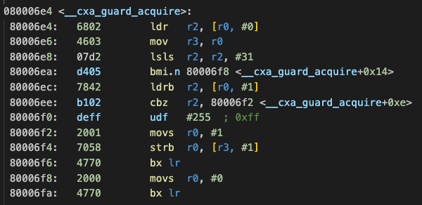
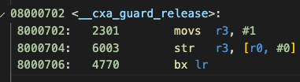
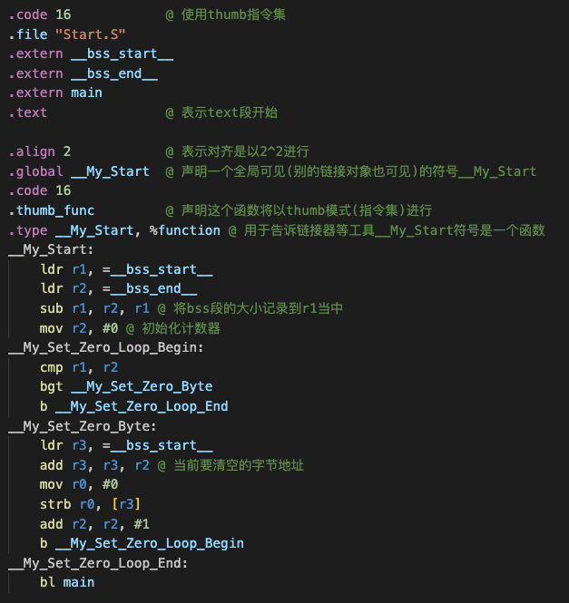

# 关于Start.S启动文件
* 首先，这个Start.S文件的作用是提供C/C++运行环境的初始化工作的。一般的bareMetal过程中，都需要一个Start.S文件，来协助进行初始化之后的运行环境。
* 对于c++而言，它初始化的内容可能包括bss段的清零，data段对象的创建以及构造函数的调用，然后跳转到真正的main函数当中。
> 当然，实际上的c++环境初始化还有很多复杂的工作

> 关于标准启动文件：
> 我们正常编写代码的时候，都不需要显式地编写c++环境初始化函数。事实上这些函数，都是由链接器提供给我们的！
> 它帮我们完成之前提到过的清零，全局变量的构造函数调用，执行main以外，还有一些异常处理的准备，main退出之后，全局变量的销毁，等等。
> 这个文件本身很复杂，且完全由汇编来编写。因为c++作为语言，它好像还没有自举的能力("使用c++编写c++运行环境初始化代码"听着就是循环引用)

## 为什么要考虑Start.S文件？
* 正如上面提到，我需要一段代码来帮助我完成c++运行时环境的初始化工作。其中就包括对bss段内容的清零操作。

* bss(有些人称为best storage section)段存储的内容是静态变量，但是没有被显式声明的。比方说，我们有如下定义的函数内局部静态变量
  ```cpp
void function()
{
	static ClassType object;
}

* 此时`object`对象就是没有显式初始化的，它会被"存储到bss段"中。
* "存储"这个行为有两方面定义：
1. bss段的区域：bss段本身在elf文件当中是没有实际内容的，因为规范决定了它们都需要被清零。因此，elf文件只会记录bss段的大小(起始位置 + 整个段的长度)
> 提示一下，通常链接脚本里面都会要求提供__bss_start以及__bss_end两个符号，用来给标准启动文件识别bss段在内存中的范围是多少
3. 访问变量时候的地址：汇编代码生成的时候，对这个静态变量的访问，它的内存地址，正是bss段指定空间中的某片区域

*  当代码执行到`function`函数的时候，object对象的构造函数就会被触发。同时，由于它是一个`static`变量，因此c++要求它的构造函数只会被执行一次。无论当前是否处于多线程环境下，"只会被执行一次"这个行为都将得到保证。

## 让static变量只被初始化一次！
* c++如何保证这个static变量只被初始化一次呢？
> 由于我的平台是单核的arm，因此不暂时不考虑多线程的情况。

* 观察c++生成的汇编代码，可以发现在紧跟着对象本身的存储空间之后，还会有4个字节的空间。这4个字节的空间称为控制块(Control Block)
> 事实上，这个块有多大，我觉得完全取决于控制逻辑的复杂度。只是我这个arm平台看到的就是4字节罢了

* 进而观察它对控制块的使用方式，发现它只使用了控制块的**前两个字节**。
    * 第一个字节用来标记当前这个对象**是否被初始化过**
    * 第二个字节用来标记当前是否**已经有线程操作过**这个控制块了。
  > 虽然是占用了一个字节的大小，但其实真正有用的只有一个字节里面的最低位

* 代码执行到`function`的时候，首先检查控制块的第一个字节，检查这个控制块是否已经被初始化过，假如是，那么直接*返回*。
  > 指的是跳过计算，直接将变量的内存地址(在编译的时候已经指定好了)直接填入寄存器
* 假如没有被初始化过，那么就会尝试对第二个字节的控制块发起申请。申请成功之后才会进入到变量的初始化当中。这个申请，其实就是一个加锁的过程，对应的也会有解锁。别的线程发现这个锁被Lock住同样会直接返回。
  > 直接看汇编，会发现构造函数的前后有一对\_\_cxa\_guard\_acquire以及\_\_cxa\_guard\_release的函数。
  > 换言之，上面第二个控制块其实可以理解为是一个"锁"对象

### 逐步分析汇编指令
以下是使用libstdc++_nano库链接之后，生成的静态变量初始化过程的汇编代码。(或许对于完整c++库，以及支持多线程的系统，对应的汇编会更加复杂)
#### 1. part A: 我们书写的c++声明静态变量

* 事实上，这段汇编代码只有2句c++代码，即最上方的`static Object _inst`以及最下方的`return _inst`。
* 首先观察最下方的两句指令(8000294, 8000298)，它们其实是一个常量，用来记录当前这个\_inst变量对象应该存储在内存的哪个位置(地址)。如上所述，这个地址是编译器链接的时候构建好的
  > 之所以是0x2000000，是链接脚本控制的，同时芯片本身也会对这一地址映射存在约束，留意阅读手册
* 之后再考虑(8000250~8000264)。这段汇编是检查内存0x2000 0004位置的一个字节数据，只考虑它的最低一位，假如这一位是1，那么r3寄存器的值置为0，否则置为1
* 之后是(800 0266 ~ 800 026e)。这段汇编是检查r3寄存器的值，假如它是0，那么指令将会跳转到800 028e的位置，即直接返回0x2000 0000地址，也就是`_inst`对象的内存地址；假如这个值是1，那么值0x2000 0004将会存入寄存器r0当中，并跳转到地址800 06e4继续执行。
    * 事实上800 026e就是对函数`__cxa_guard_aquire`的调用，这个函数是c++静态库内的一个函数，如其名，应该是负责管理加锁的
    * 不难推测，控制块0x2000 0004就存储了当前静态对象的控制块了
* 我们先暂时不看`__cxa_guard_aquire`的汇编实现，继续看(800 0272~800 028a)的汇编内容
* 剩下的指令就是将`__cxa_guard_aquire`的返回值，从r0寄存器里面拿到r3寄存器。假如返回值是0，那么r3寄存器依旧是0，否则就被置为1。
* 继续，假如r3的值是0，那么函数将直接返回；否则就会开始执行`Object`的构造函数，对`_inst`对象进行初始化，并在初始化完成后调用`__cxa_guard_release`并返回`_inst`对象
    * 确实，这中间似乎会出现前面调用了"加锁"，但后面却没有进行"锁释放"的行为。
    * 事实上，不难猜测`__cxa_guard_aquire`内部，肯定还有别的操作，进一步判断当前是否已经加过锁，并在之前已经加过锁的情况下给到返回值告诉外部aquire失败

#### 2. Part B: c++静态库中的函数实现
接下来的是__cxa_guard_acquire的汇编实现，请记住，在partA中我们将0x2000 0004这个值传入了r0寄存器当中

* 这段代码描述的内容是:
    * 首先，检查0x200 0004地址的第一个字节(就是这个地址本身存储的字节内容)。假如它是1，那么直接返回
> 这里的汇编用了一个很绕的写法，lsls是将寄存器的值左移，这里是左移31位，相当于将低地址的最低位直接挪到最高位。
> *再补充几点内容：stm32用的芯片是小端的，寄存器是32bit的*
> bmi.n 是判断上一个操作中的结果是不是负数，即最高位是不是1.
> 两个指令拼起来其实只是想判断原来地址的一个字节的最低位是不是1而已

* 正如partA中提到，地址0x2000 0004之前已经有判断过它最低位是不是1了，这里再判断一次，更像是一种"双重确认"(为了避免并行问题？)
* 假如0x2000 0004的第一个字节的最低位是0，那么会读取读取0x2000 0005地址的一个字节数据。假如这个字节的值为0，那么跳到800 06f2位置继续执行，此时函数返回0。可假如不是0，即没有进行跳转，那么`udf #255`将是一条"未定义指令"，可以理解成`abort()`，
> 其实到这里，就说明为什么bss段的内容必须要在程序运行前清0。因为c++静态库函数中，很多初始状态的判断都会将0作为默认的初始值！
* 假如一切顺利，那么0x2000 0005这个地址将会被写入一字节数据1，同时返回1。

* 小结一下就是：`__cxa_guard_aquire`函数会重复判断一遍0x2000 0004的第一个字节最低位是否为1，假如是则没有加锁的行为返回0。其次还会判断0x2000 0005的第一个字节是否0，假如为0，则加锁成功，返回1。同时，之后的代码都应该在判断0x2000 0004的第一个字节最低位为1时，直接返回

#### 3. Part C

* 这个"解锁"的行为就很简单了，纯粹只是将之前0x2000 0004的控制块的第一个字节的最低位置为1。也就是下次再进行`__cxa_guard_aquire`的时候，都直接"加锁失败"，也就是说这个静态变量已经初始化过了

以上就是静态变量的初始化过程，以及静态变量是怎么保证只被初始化一次的。从这个过程中不难看出，控制块是位于bss段当中的，只有在运行前将bss段对应的内存区域全部清0，程序才能正常运转。

一旦没有显式的清0行为，那么程序只会在偶然的情况下才能"正常"运行。

而对bss段清0的行为，是在c++程序真正开始运行之前就发生的。要准备c++的运行环境，这就是Start.S文件存在的重要意义！！！
以下是近清空bss段地址空间的Start.S代码，以供参考
