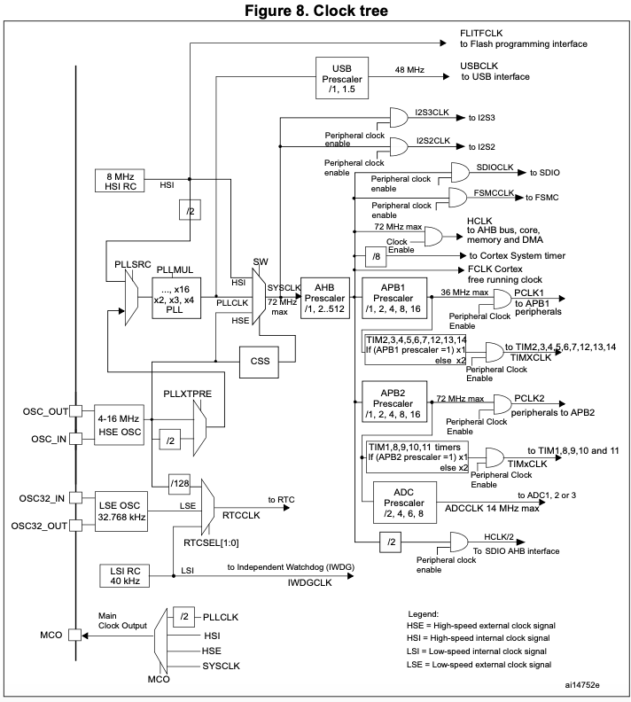
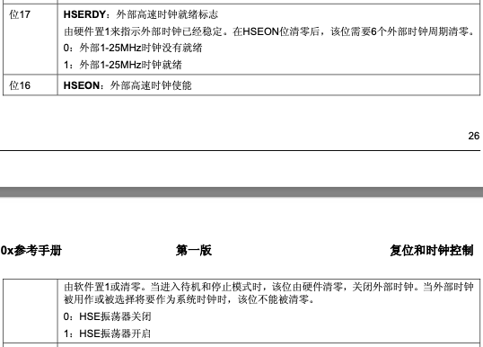
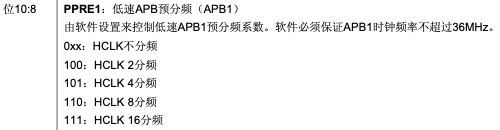
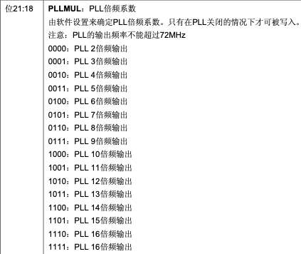
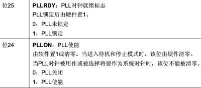
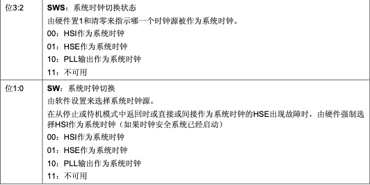
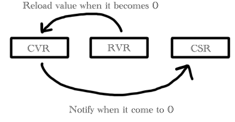
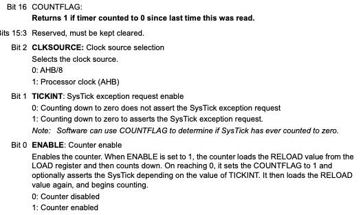

# 关于时钟初始化以及延时函数

## 时钟初始化
* 时钟初始化建议在机器执行主要功能之前就开始设置。设备的主频决定了各总线上的时钟频率。时钟频率也可以在运行时进行修改(暂时没有涉足)
* 观察时钟树：

1. 时钟信号的两个关键来源是HSI(High Speed Internal clock)以及HSE(High Speed External clock)
    a. HSI是芯片内部自带的振荡器，默认频率8MHz
    b. HSE是板载外设的振荡器(银色的石英晶振)，理论上频率也是8MHz
    c. 理论上HSE的精度要高于HSI
2. 时钟信号还有一个是通过一系列分频和倍频之后的，来自锁相环PLL的时钟信号。PLL的信号源其实还是HSI活着HSE只是频率会有所不同
3. 大部分设备都通过AHB进行连接，时钟信号最后也会输出到AHB上，经过若干分频和倍频给到不同的设备

4. 我们通过设置RCC寄存器中的位，来控制时钟信号源以及分频和倍频大小。

## RCC寄存器设置
* 寄存器的基地址：0x40021000u
* 设置时钟时，应该先从时钟树的"叶子"开始往"根节点"进行设置。这是为了确保所有的倍频分频都设置正确后，才正式调整频率
* 接下来，假设我们希望核心一直处在最大72MHz频率下进行工作。
* 意味着给到SYSCLK的时钟频率是72MHz
  
### 首先尝试启动外部时钟(HSE)
* 查询手册，可知时钟控制寄存器(RCC\_CR)的第16和第17位分别用来控制外部时钟的开关以及检查外部时钟是否就绪
    * 
    * 其中，第17位是硬件设置的。可以理解为只读。代码中通过While循环来检查该位是否设置完成！
### APB1总线设置
* 观察之后连接的**总线APB1**，它限制了最大的工作频率是36MHz。因此为了保险起见，可以将它的分频器设置为/2，即2分频
    * 查询手册，可知时钟配置寄存器(RCC\_CFGR)的第10:8位用来控制APB1的分频
    * 
    * 将对应位设置为100即是进行2分频
### PLL锁相环设置
* 为了能够拉到最大72MHz的时钟频率，我们需要使用PLL对外部时钟进行倍频
* 首先观察时钟树的PLL相关路径：
    * HSE首先连接到PLLXTREE。同样查询手册可以发现这个PLLXTREE是RCC_CR寄存器中进行设置的，而且上电复位后默认是选择不分频的路径
    * PLLXTREE的信号出来之后会走到PLLSRC。是由RCC\_CFGR寄存器进行设置。上电复位后默认是选择HSI且2分频之后的结果作为输入。
        * 需要将它修改为来自HSE，即PLLXTREE输出的信号。
        * 但是这一步先不要急，先将之后的倍频系数设置完成
    * PLLSRC之后的信号会经过PLLMUL进行倍频。之前的HSE信号是8MHz且路径上没有进行分频处理，因此这里的倍频选择9
        * 
        * 倍率通过设置RCC_CFGR寄存器的21:18位来完成。且从文档中还知道PLLMUL的设置**只有在PLL关闭的情况下才能进行设置！**
    * PLLMUL倍频完的信号进入到SW中，该SW控制时钟信号的来源。但请注意，此时我们还没有将PLL开启(否则我们也无法设置PLLMUL)
        * PLL的开启由寄存器RCC_CR寄存器控制
        * 
        * 我们只需要设置PLLON，将PLL打开。之后同样通过While循环查询PLLRDY，检查PLL时钟是否就绪
    * 设置完成后就可以设置SW，将PLL作为系统时钟源
        * SW的设置以及状态查询由寄存器RCC_CFGR完成
        * 
        * 和PLL开关类似。我们只设置SW，并通过While来查询SWS的状态，直到硬件通知我们设置完成
     
以上就是将系统时钟源初始化为外部时钟，并将频率设置为72MHz的流程

### 小结
整个流程就是：
启动外部时钟并等待外部时钟就绪 -> 设置APB1分频为2分频 -> 设置PLL倍频为9 -> 设置PLL来源为HSE -> 将Flash的时钟时延设置为2 -> 启动PLL时钟源并等待就绪 -> 将PLL作为系统时钟源并等待就绪

是的，这里还有一个Flash时钟时延的设置，我暂时不知道它是干嘛的。但似乎外部主频不同，Flash的时延也有所不同，似乎和Flash的读取有关系。

## 延时函数实现
上面的系统时钟初始化之后，就可以基于72MHz的主频实现延时函数了。STM32F103使用的是Arm Cortex-M3处理器，这个处理器内置了一个计数器，延时函数就是通过这个计数器完成。

> 计数器实际上就是一个寄存器，每次时钟信号的上升沿到来，就会将自己的值减1，假如寄存器中的值变成了0，就会发起"通知"。我们通过时钟信号的频率，推算出1ms需要经过多少次上升沿，然后让计数器计算对应的次数。那么我们只要"监听"这个通知，就能够实现"准确延时"的功能

> 另外需要注意的是，这个计数器是来自Cortex-M3内部的，因此对应的手册就应该直接查阅Arm的编程手册，而不是STM32的。
>
检查Arm的手册可知，这个Cortex-M3的计数功能由2个"值寄存器"和一个"状态寄存器"组成。它们的关系大概是这样的

* CVR：Current Value Register，对应手册里面的STK\_VAL。存储当前计数器的值，每次时钟上升沿到来，里面的值就会减1
* RVR：Reload Value Register，对应手册里面的STK\_LOAD。当CVR的值为0时，RVR的值就会被用来重置CVR
* CSR：Control and Status Register，对应手册里面的STK\_CTRL。用来控制整个计时器(计数器)的运转以及监听状态
* CSR寄存器可以用来控制计数器的开关，计数器时钟的时钟信号来源，计数结束之后是否要发起系统中断以及当前计数是否完成
* 
    * 默认情况下，这个计数器中的所有值都会被置为0。
    * CLKSOURCE的时钟源可以选择AHB的8分频或者不分频。我们都会选择8分频。因为这样可以延时的时间会更长一点。我们给到AHB的时钟频率是72MHz，8分频就是9MHz。因此计数器CVR每减1，相当于过去了0.111us。计数器跳9下，相当于过了1us
    * 其次需要关注的是COUNTFLAG，当CVR计数归零之后，这个bit会被硬件置为1。假如我们不是通过硬件中断来监听延时信息的话，可以通过轮询这个bit的状态来进行阻塞延时。
* CVR以及RVR寄存器本质上只是一个数值寄存器，但是它只有**24bit**可用！！换句话说，假如我们的计数器频率是9MHz，那么这个计数器最多只能延时1.7s。一旦超过出来的值就不对了！

* 延时函数其实就是设置上面3个寄存器，流程是：
* 将计数器时钟源设置为8分频AHB总线频率 -> 设置Reload数值 -> 清空当前计数器值 -> 使能计数器开始计时 -> 不断轮询CSR的COUNTFLAG直到它被置为1 -> 关闭计数器并清空当前计数器值

# 坑
* &操作符的优先级要比==操作符的优先级低！！！！
* COUTFLAG的值是硬件设置的，假如是用一个中间变量来存储CSR的值，那么这个变量必须声明为volatile类型。这样编译器才不会进行优化。
    * 假如编译发现变量A两次都是从同一个代码读取数值，而且变量A还没有进行volatile修饰，那么它会省略掉之后的读取流程，因为它认为两次都是相同的结果，之后的读取就省略了！
    * 而用volatile修饰之后，编译器就算遇到相同的读取代码，也会再执行一遍读取而不是省略。
    * 因此volatile的作用就是当变量从同一个地址读取内容时，若用户确定该地址的内容有可能被外部修改，那么volatile就可以强制让编译器重新读取地址的内容，而不是沿用旧值。